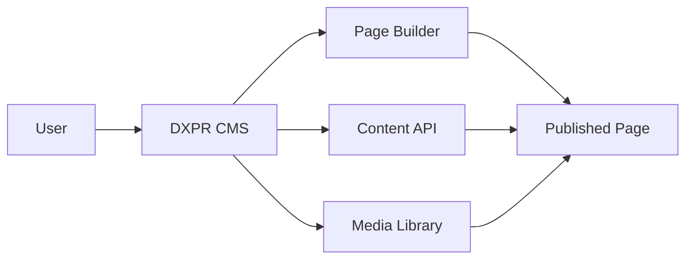
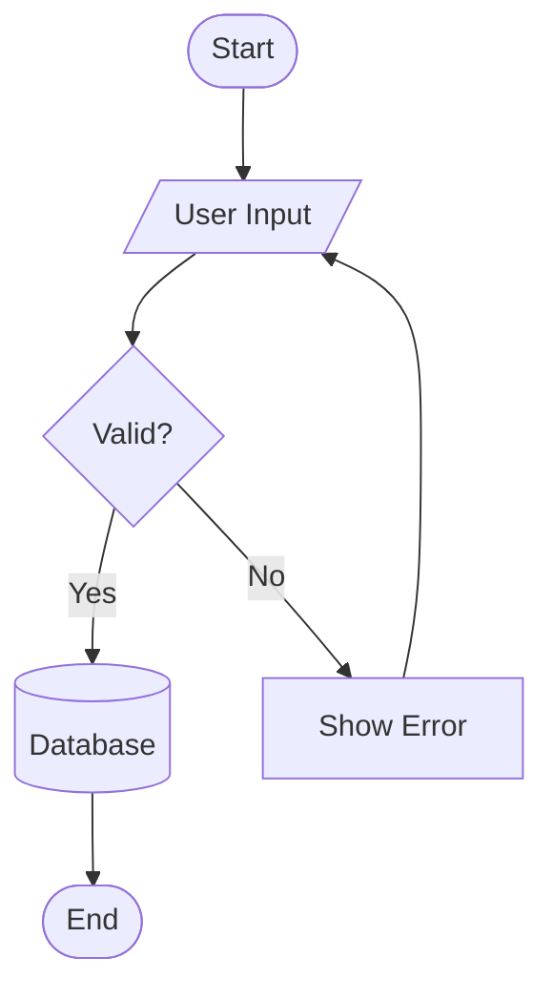

# Kitchen Sink Demo - MkDocs Material Features

This page demonstrates all the features available in our MkDocs Material documentation setup.

## Text Formatting

### Basic Formatting

- **Bold text** using `**bold**`
- *Italic text* using `*italic*`
- ***Bold and italic*** using `***bold italic***`
- ~~Strikethrough~~ using `~~strikethrough~~`
- ==Highlighted text== using `==highlight==`
- ^^Superscript^^ using `^^superscript^^`
- ~~Subscript~~ using `~~subscript~~`

### Keyboard Keys

Press ++ctrl+alt+del++ to restart. Use ++cmd++ on Mac or ++ctrl++ on Windows.

## Code Blocks

### Inline Code

Use `pip install mkdocs-material` to install the theme.

### Code Block with Syntax Highlighting

```python title="example.py" linenums="1" hl_lines="2 4"
def hello_world():
    """This line is highlighted"""
    print("Hello, World!")
    return True  # This line is also highlighted
```

### Code Block with Line Numbers

```javascript linenums="1"
// JavaScript example with line numbers
function calculateSum(a, b) {
    return a + b;
}

const result = calculateSum(5, 3);
console.log(`Result: ${result}`);
```

### Tabbed Code Blocks

=== "Python"

    ```python
    def greet(name):
        return f"Hello, {name}!"
    ```

=== "JavaScript"

    ```javascript
    function greet(name) {
        return `Hello, ${name}!`;
    }
    ```

=== "PHP"

    ```php
    function greet($name) {
        return "Hello, {$name}!";
    }
    ```

## Admonitions

!!! note "This is a note"
    Lorem ipsum dolor sit amet, consectetur adipiscing elit. Nulla et euismod nulla.

!!! tip "Pro tip"
    Use admonitions to highlight important information.

!!! warning "Be careful!"
    This action cannot be undone.

!!! danger "Critical warning"
    This will delete all your data!

!!! success "Well done!"
    You have successfully completed the task.

!!! question "Did you know?"
    MkDocs can be extended with many plugins.

!!! info "Information"
    This is some general information.

!!! example "Example usage"
    ```bash
    mkdocs serve --dev-addr=0.0.0.0:8000
    ```

### Collapsible Admonitions

??? note "Click to expand"
    This content is hidden by default. Click the title to reveal it.

???+ tip "Expanded by default"
    This content is visible by default but can be collapsed.

## Lists

### Unordered List

- First item
- Second item
  - Nested item 2.1
  - Nested item 2.2
    - Deep nested item 2.2.1
- Third item

### Ordered List

1. First step
2. Second step
   1. Sub-step 2.1
   2. Sub-step 2.2
3. Third step

### Task List

- [x] Completed task
- [x] Another completed task
- [ ] Pending task
- [ ] Future task

### Definition List

Term 1
:   Definition for term 1

Term 2
:   Definition for term 2
:   An alternative definition for term 2

## Tables

### Basic Table

| Feature | Description | Status |
|---------|------------|--------|
| Page Builder | Visual drag-and-drop editor | ✅ Stable |
| SEO Tools | Built-in SEO optimization | ✅ Stable |
| AI Integration | GPT-powered content | 🚧 Beta |
| Multilingual | Support for 100+ languages | ✅ Stable |

### Aligned Table

| Left Aligned | Center Aligned | Right Aligned |
|:------------|:--------------:|-------------:|
| Text        | Text           | Text         |
| More text   | More text      | More text    |
| Even more   | Even more      | Even more    |

## Images and Media

### Image with Caption

{ width="600" }
*Figure 1: DXPR CMS Logo - Where marketers fall in love with Drupal*

### Image with Lightbox (GLightbox)

Click on the image below to open it in a lightbox:

{ .glightbox width="800" }

## Diagrams

### Mermaid Diagrams



### Flowchart



## Content Tabs

=== "Installation"

    ## Install via Composer

    ```bash
    composer create-project dxpr/dxpr_cms my_site
    cd my_site
    lando start
    ```

=== "Configuration"

    ## Configure Settings

    1. Navigate to `/admin/config`
    2. Set up your site information
    3. Configure the page builder
    4. Enable desired modules

=== "Usage"

    ## Creating Your First Page

    1. Go to **Content** → **Add content**
    2. Choose **Landing Page**
    3. Use the drag-and-drop builder
    4. Save and publish

## Mathematical Expressions

When $a \ne 0$, there are two solutions to $(ax^2 + bx + c = 0)$ and they are:

$$x = {-b \pm \sqrt{b^2-4ac} \over 2a}$$

## Footnotes

DXPR CMS is built on Drupal[^1], the world's most flexible CMS platform. It includes a powerful page builder[^2] that requires no coding knowledge.

[^1]: Drupal is an open-source content management framework
[^2]: The DXPR Builder uses a drag-and-drop interface

## Links and References

### External Links

- [DXPR Website](https://dxpr.com)
- [Drupal.org](https://drupal.org)
- [MkDocs Material](https://squidfunk.github.io/mkdocs-material/)

### Internal Links

- [Back to Home](index.md)
- [Installation Guide](getting-started/installation.md)
- [API Reference](api/modules.md)

### Anchor Links

Jump to sections:

- [Code Blocks](#code-blocks)
- [Admonitions](#admonitions)
- [Tables](#tables)

## Blockquotes

> "Where marketers fall in love with Drupal"
>
> (DXPR Team)

### Nested Blockquote

> This is the outer quote
>
> > This is a nested quote
> >
> > > Even deeper nesting

## Horizontal Rules

---

Above is a horizontal rule (using `---`)

***

Another style (using `***`)

___

And another (using `___`)

## HTML in Markdown

<div class="grid cards" markdown>

- :material-clock-fast:{ .lg .middle } __Set up in 5 minutes__

    ---

    Install DXPR CMS with a single command and start building immediately.

    [:octicons-arrow-right-24: Getting started](getting-started/installation.md)

- :material-pencil-ruler:{ .lg .middle } __It's just Drupal__

    ---

    Built on Drupal core with additional tools for marketers and content creators.

    [:octicons-arrow-right-24: Learn more](features/index.md)

</div>

## Critic Markup

Text can be {--deleted--} and {++added++}. This is {~~bad~>good~~} example.

Text can be {==highlighted==} and {>>commented<<}.

## Custom Containers

<div class="admonition tip">
<p class="admonition-title">Custom HTML Tip</p>
<p>This is a custom HTML admonition for special cases.</p>
</div>

## Emoji Support

:smile: :heart: :rocket: :fire: :star: :check: :x: :warning:

- :material-language-python: Python
- :material-language-javascript: JavaScript
- :material-language-php: PHP
- :fontawesome-brands-drupal: Drupal

## Abbreviations

The HTML specification is maintained by the W3C.

*[HTML]: Hyper Text Markup Language
*[W3C]: World Wide Web Consortium
*[CMS]: Content Management System
*[API]: Application Programming Interface

## Advanced Features

### Details/Summary

<details>
<summary>Click to reveal advanced configuration</summary>

```yaml
# Advanced mkdocs.yml configuration
site_name: DXPR CMS
theme:
  features:
    - navigation.instant
    - navigation.tracking
    - navigation.tabs
```

</details>

### Print Support

This documentation is optimized for printing. Use ++ctrl+p++ to print this page.

## GitLab Pages Integration

This documentation is automatically deployed to GitLab Pages when changes are pushed to the main branch. The pipeline:

1. Builds the documentation using MkDocs
2. Generates static HTML files
3. Deploys to GitLab Pages
4. Makes it available at your project's pages URL

### Version Management

We use `mike` for version management. Current version: **1.0.0**

To deploy a new version:

```bash
mike deploy 1.1.0 latest --push
mike set-default latest --push
```

## Meta Information

| Property | Value |
|----------|-------|
| Last Updated | {date} |
| Version | 1.0.0 |
| License | GPL-2.0+ |
| Repository | [GitHub](https://github.com/dxpr/dxpr_cms) |

---

!!! success "Congratulations!"
    You've reached the end of the kitchen sink demo. This page showcases most of the features available in our MkDocs Material setup. Use these examples as templates for your own documentation!
